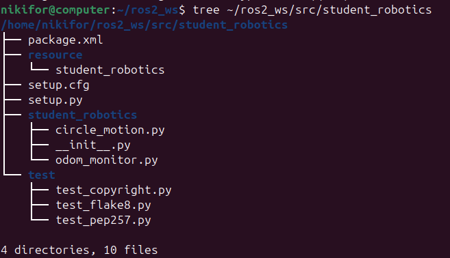
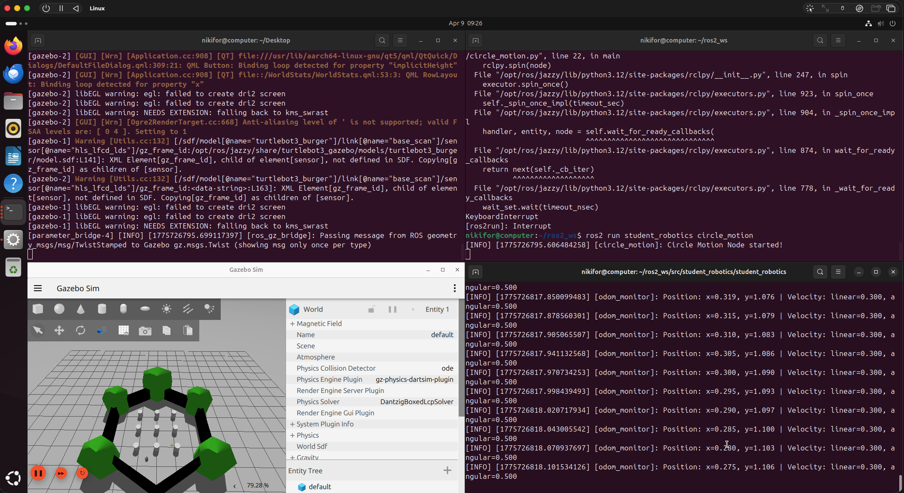
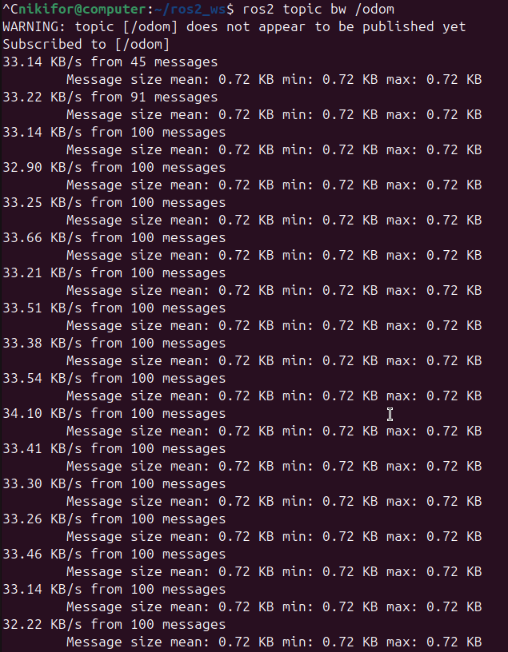
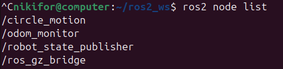
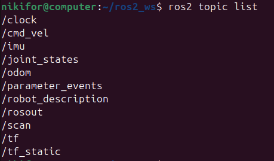
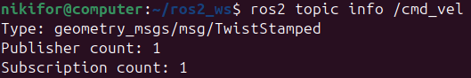
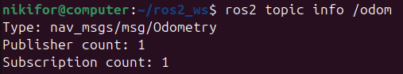
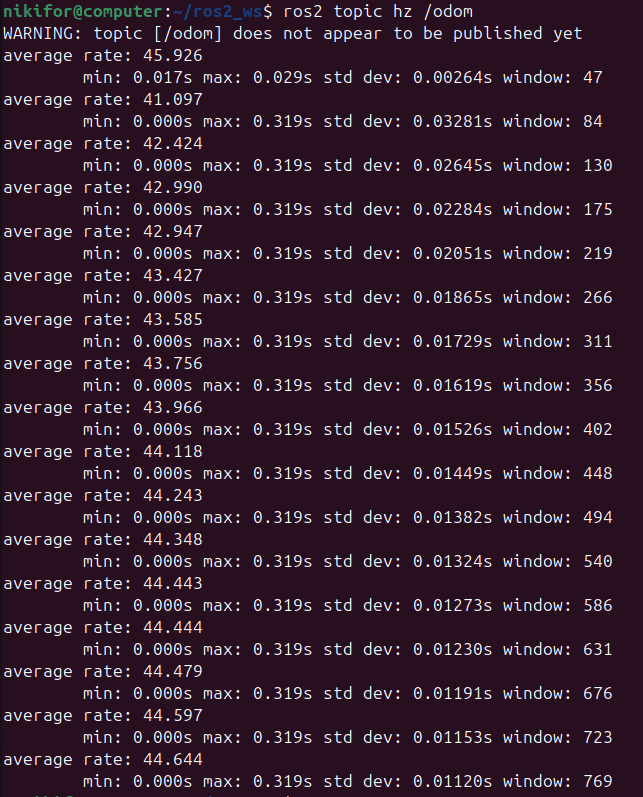
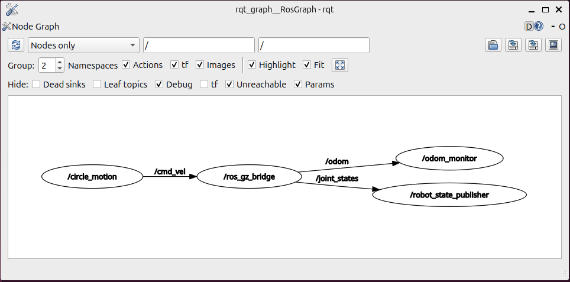

# Lecture 6 - ROS2 Demo
**Repository:** https://github.com/nlklfor/lecture6-ros2demo

**Name:** Mykyta Slieptsov  
**Student ID:** 25-137-050  
**ROS2 Version:** Jazzy (Ubuntu 24.04 ARM64)

---

## Aufgabe 1: Create ROS2 Package & Publisher-Subscriber Nodes

### (a) Package Creation & Circle Motion Publisher

#### Package Structure


#### circle_motion.py
```python
import rclpy
from rclpy.node import Node
from geometry_msgs.msg import TwistStamped

class CircleMotion(Node):
    def __init__(self):
        super().__init__('circle_motion')
        self.publisher = self.create_publisher(TwistStamped, '/cmd_vel', 10)
        self.timer = self.create_timer(0.1, self.timer_callback)
        self.get_logger().info('Circle Motion Node started!')

    def timer_callback(self):
        msg = TwistStamped()
        msg.header.stamp = self.get_clock().now().to_msg()
        msg.twist.linear.x = 0.3
        msg.twist.angular.z = 0.5
        self.publisher.publish(msg)

def main(args=None):
    rclpy.init(args=args)
    node = CircleMotion()
    rclpy.spin(node)
    node.destroy_node()
    rclpy.shutdown()

if __name__ == '__main__':
    main()
```

#### Screenshot: Robot moving in circles in Gazebo


#### Why use create_timer()?
`create_timer()` allows the node to publish messages at a fixed frequency (10 Hz) without blocking the main thread. It integrates with the ROS2 executor so the node can handle callbacks and spin efficiently at the same time.

---

### (b) Odometry Subscriber

#### odom_monitor.py
```python
import rclpy
from rclpy.node import Node
from nav_msgs.msg import Odometry

class OdomMonitor(Node):
    def __init__(self):
        super().__init__('odom_monitor')
        self.subscription = self.create_subscription(
            Odometry,
            '/odom',
            self.odom_callback,
            10)
        self.get_logger().info('Odom Monitor Node started!')

    def odom_callback(self, msg):
        x = msg.pose.pose.position.x
        y = msg.pose.pose.position.y
        linear_x = msg.twist.twist.linear.x
        angular_z = msg.twist.twist.angular.z
        self.get_logger().info(
            f'Position: x={x:.3f}, y={y:.3f} | '
            f'Velocity: linear={linear_x:.3f}, angular={angular_z:.3f}'
        )

def main(args=None):
    rclpy.init(args=args)
    node = OdomMonitor()
    rclpy.spin(node)
    node.destroy_node()
    rclpy.shutdown()

if __name__ == '__main__':
    main()
```

#### Screenshot: Both nodes running


#### Screenshot: ros2 node list


#### How does pub-sub decoupling work?
In ROS2, publishers and subscribers are completely decoupled — they do not need to know about each other directly. The publisher sends messages to a topic and any number of subscribers can listen to that topic independently. This means nodes can be started, stopped, or replaced without affecting other nodes in the system.

---

## Aufgabe 2: ROS2 Topic Inspection & Message Frequency Analysis

### (a) ROS2 CLI Topic Commands

#### ros2 topic list


#### ros2 topic info /cmd_vel


#### ros2 topic info /odom


#### ros2 topic hz /odom


#### ros2 node list


#### What is /odom frequency? Why does frequency matter?
The /odom topic publishes at approximately 10 Hz. Frequency matters for robot control because higher frequency means more up-to-date position data, which allows the controller to react faster to changes and maintain more precise motion control.

#### Publishers and subscribers of /cmd_vel
- Publisher count: 1 → `/circle_motion`
- Subscriber count: 1 → `/ros_gz_bridge`

#### Difference between ros2 topic hz and ros2 topic bw
`ros2 topic hz` measures the publishing frequency of a topic in Hz (messages per second). `ros2 topic bw` measures the bandwidth — how many bytes per second are being transmitted on that topic.

---

### (b) Visualize Communication Graph

#### rqt_graph


#### What does the graph show?
The graph shows three main nodes: `/circle_motion` publishes velocity commands to `/cmd_vel`, which goes through `/ros_gz_bridge` to Gazebo. The bridge then publishes `/odom` data which `/odom_monitor` subscribes to, demonstrating the full pub-sub pipeline from command to feedback.

#### What happens if you stop circle_motion?
If `circle_motion` is stopped, `odom_monitor` continues to work because it only subscribes to `/odom` which is published by `ros_gz_bridge` independently. The robot stops moving but odometry data keeps being published as long as Gazebo is running.

---

## Commands Used
```bash
# Install ROS2 Jazzy
sudo apt install ros-jazzy-desktop

# Install TurtleBot3
sudo apt install ros-jazzy-turtlebot3*

# Create workspace and package
mkdir -p ~/ros2_ws/src
cd ~/ros2_ws/src
ros2 pkg create --build-type ament_python student_robotics \
  --dependencies rclpy geometry_msgs nav_msgs

# Build
cd ~/ros2_ws
colcon build --packages-select student_robotics
source install/setup.bash

# Launch simulation
ros2 launch turtlebot3_gazebo turtlebot3_world.launch.py

# Run nodes
ros2 run student_robotics circle_motion
ros2 run student_robotics odom_monitor
```

## Issues Encountered
- **Display output not active in UTM**: Fixed by installing `spice-vdagent` via serial console
- **Robot not moving**: Gazebo Harmonic requires `TwistStamped` instead of `Twist` for `/cmd_vel`
